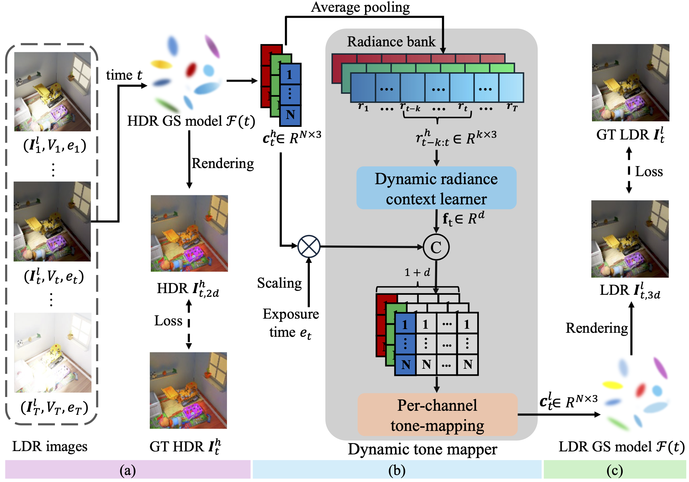

# Dynamic Novel View Synthesis in High Dynamic Range
### [Project page](https://x-up-lab.github.io/research/hdr-4dgs) | [Paper](https://arxiv.org/abs/2509.21853) | [Videos](https://drive.google.com/drive/folders/1h1rNCGbVTqb51h4yRyg5xnvd1muXKC0A?usp=sharing)
> [**Dynamic Novel View Synthesis in High Dynamic Range**](https://arxiv.org/abs/2509.21853),            
> Kaixuan Zhang, Zhipeng Xiong, Minxian Li, Mingwu Ren, Jiankang Deng, [Xiatian Zhu](https://x-up-lab.github.io/)  
> **Nanjing University of Science and Technology**, **Imperial College London** and **University of Surrey** \
> **ICLR 2026**


**This repository is the official implementation of "Dynamic Novel View Synthesis in High Dynamic Range".** In this paper, we propose a more
realistic problem named HDR Dynamic Novel View Synthesis (HDR DNVS), where the additional dimension “Dynamic” emphasizes the necessity of jointly
modeling temporal radiance variations alongside sophisticated 3D translation between LDR and HDR. To tackle this complex, intertwined challenge, we introduce
HDR-4DGS, a Gaussian Splatting-based architecture featured with an innovative
dynamic tone-mapping module that explicitly connects HDR and LDR domains,
maintaining temporal radiance coherence by dynamically adapting tone-mapping functions according to the evolving radiance distributions across the temporal dimension.


## 🛠️ Pipeline
<div>
  
</div>


## Get started

### Environment

The hardware and software requirements are the same as those of the [4D Gaussian Splatting](https://github.com/fudan-zvg/4d-gaussian-splatting), which this code is built upon. To setup the environment, please run the following command:

```shell
git clone https://github.com/prinasi/HDR-4DGS
cd HDR-4DGS
conda env create --file environment.yml
conda activate 4d_gaussian_splatting
```

### Data preparation

**HDR-4D-Syn dataset:**

Download the proposed [HDR-4D-Syn dataset](https://drive.google.com/drive/folders/1L4hBtsSQ-us3biPpc8jvimr-FNy89sTU?usp=sharing) and put each scene to `data/HDR-4D-Syn`.

**HDR-4D-Real dataset:**

The dataset can be downloaded from [google drive](https://drive.google.com/drive/folders/18zVc3u47bV-8OX6E8AlvfOiWQX7EDuU8?usp=sharing).  Then, put each scene into `data/HDR-4D-Real`.


### Running

After the installation and data preparation, you can train the model by running:

```shell
chmod u+x ./single_train.sh
./single_train.sh <scene_name> <gpu_id>
```

## 📜 BibTex
```bibtex
@inproceedings{zhang2025dynamicnovelviewsynthesis,
  title={Dynamic Novel View Synthesis in High Dynamic Range},
  author={Kaixuan Zhang and Zhipeng Xiong and Minxian Li and Mingwu Ren and Jiankang Deng and Xiatian Zhu},
  booktitle = {International Conference on Learning Representations (ICLR)},
  year={2026}
}
```